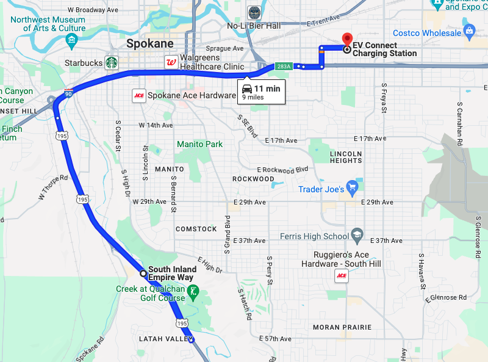
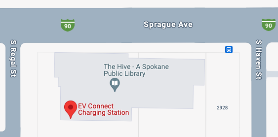

# EV Charge Station Optimizer

## Purpose and Motivation

This project uses machine learning optimization techniques and the Google Maps API to find the ideal location for new electric vehicle charging infrastructure.

According to government data cited in a late Dec 2023 [article in the WSJ](https://www.wsj.com/business/autos/investors-sour-on-ev-charging-companies-f6318bfb), the U.S. has around 159,000 public charging ports now at 60,000 locations. The supply required to meet EV demand over the next 5 years varies from a tripling to a 10x increase:
> President Biden aims to have 500,000 public chargers in the ground by 2030. Consulting firm McKinsey estimates that around 1.5 million public chargers would be needed by then if half of car sales are electric.

Also cited in this article are the difficulties EV charging companies have remaining economically viable during this classic "chicken-and-egg" problem of supplying the EV charging infrastructure needed in advance of demand for EVs in order to reduce range anxiety and consumers' reluctance to commit to an EV purchase. However, the capital investment required to build out charging locations before consumers are buying electricity places a heavy burden on the for-profit EVSE enterprise. Placing this infrastructure in strategically optimized locations could help them acheive return on their investment in the near term.

## Sample Script Run
An example in `src/main.py` after loading lat/long values from a .csv file in Google Cloud Storage into a Pandas dataframe
```python
    # get csv data from Cloud Storage
    my_storage = GCSClient()
    my_data_inmem = my_storage.download_blob_into_memory('wipeout.csv')
    csvStringIO = BytesIO(my_data_inmem)
    df = pd.read_csv(csvStringIO, sep=",")
    get_a_loc=df[['ERS_LATITUDE','ERS_LONGITUDE']].iloc[0]

    # do map stuff
    my_gmap_client = GMapClient()
    search_loc = {'latitude': get_a_loc.ERS_LATITUDE, 'longitude': get_a_loc.ERS_LONGITUDE} # from above
    radius = 10.0
    print(f'Searching nearest EV charging stations in {str(radius)} km radius from {search_loc}')
    distance = my_gmap_client.find_closest_station(radius, search_loc) # could accept default lat/lng from init
    print(f'Distance to nearest station: {str(distance/1000)} km')
```
The raw data elements (source described below) include: `VEHICLE YEAR MAKE MODEL, TOW FROM LATITUDE LONGITUDE, NEAREST CITY`
The first sample data element is:
```python
['2018 NISSAN LEAF', 47.61453 -117.42536, 'Spokane WA']
```
The next-nearest station search algorithm runs in `main.py` looking in 10km radius and outputs the following:
```
❯ poetry run python src/main.py
Searching nearest EV charging stations in 10.0 km radius from {'latitude': 47.61453, 'longitude': -117.42536}
Distance to nearest station (ID: ChIJAQBMiKYYnlQREbjQNFL7cVI): 14.441 km
Place Types: ['electric_vehicle_charging_station', 'point_of_interest', 'establishment']
EV Charging Station: EV Connect Charging Station: 2904 E Sprague Ave, Spokane, WA 99202, USA
connector_count: 2
connector_aggregation {
  type_: EV_CONNECTOR_TYPE_CCS_COMBO_1
  max_charge_rate_kw: 180
  count: 1
  available_count: 0
  out_of_service_count: 0
  availability_last_update_time {
    seconds: 1704335400
  }
}
connector_aggregation {
  type_: EV_CONNECTOR_TYPE_CHADEMO
  max_charge_rate_kw: 100
  count: 1
  available_count: 0
  out_of_service_count: 0
  availability_last_update_time {
    seconds: 1704335400
  }
}
```

Verifying this route directly by putting in the same `LAT/LNG` values and asking for directions to an "ev station":



We see that `14.441 km` matches the web result of `9.0 mi`. Note also it appears to be a public library (useful later for searching for alternate EV charging sites).



## Data Sources
Optimum EV Charging Infrastructure locations comes from several sources.

### Points of Origin

The first task is to select the starting point from which to target a new nearest station.

#### [AAA EVs Out of Charge data](https://autoinsights.aaa.biz/products/evs-out-of-charge)
This data was selected first, specifically targeting places where their customers have had to call for assistance due to an out-of-charge incident. 

Since this data costs $200 per state and year of data, I have purchased this out-of-pocket and placed the files in a secure S3 bucket only my AWS API credentials can access.

Using the vehicle make and model, we will also determine the charge connector type and validate that against the nearby charging station available connector types, as provided in the Google Maps API response.

A 2018 Nissan Leaf in the example above does support the CHAdeMO connector. However 14.4 km may have been too far for this driver to reach on low charge.

#### [EVRI eRoadMap](https://eroadmap.epri.com/)

An interactive map showing where electricity infrastructure is needed to accomodate full electrification of all vehicles by 2030.

This data was selected second since it has already been vetted for EV infrastructure needs in the long-term, and EV infrastructure is a long-term investment.

According to their [FAQ](https://eroadmap.epri.com/docs/eRoadMAP_FAQs_F_11172023.pdf):

> Through a collaborative, anonymous, secure, and transparent process, EPRI worked with a number of analytical partners and data providers to collect both publicly available
and proprietary data - such as vehicle registrations, trip data and driving patterns, vehicle efficiencies, electrification plans, and state and federal policy. This data was used in
combination with projected EV adoption in different areas of the country to develop the eRoadMAP estimates.

> This tool reflects a combination of both high-confidence data sources and simulations of expected adoption. As EPRI gathers more and more data, the confidence in the
energy estimates at each hexagon will rise. It should also be noted that generally as one zooms in to smaller and smaller hexagons, the certainty will decrease as the data is
reliant on the behavior of fewer vehicles rather than an aggregated number"

### Finding Optimum Destinations

#### Google Maps [Places](https://developers.google.com/maps/documentation/places/web-service/?apix=true) and [Routes](https://developers.google.com/maps/documentation/routes) APIs

This API is used to route from an origin above to a nearest station and find the total driving distance via the best route (not linear distance or "as the crow flies"). If there is not one with a valid connection type for the stranded vehicle within 15 kilometers (parameter to be tuned), then one will be generated by the ML optimization routine.

Note, the Google Maps Places API provides the following data on the charging stations:
```python
  ev_charge_options {
    connector_count: 2
    connector_aggregation {
      type_: EV_CONNECTOR_TYPE_J1772
      max_charge_rate_kw: 6.4800000190734863
      count: 2
      available_count: 2
      out_of_service_count: 0
      availability_last_update_time {
        seconds: 1702313400
      }
    }
  }
```
The available list of connector types is published in the [google.maps.places.v1 API documentation](https://developers.google.com/maps/documentation/places/web-service/reference/rpc/google.maps.places.v1#google.maps.places.v1.EVConnectorType).

The NREL data describe below also has this data as:
```json
"ev_connector_types":["CHADEMO","J1772"]
```

This is important because, without a compatible connector or an adapter in the vehicle, the stranded driver cannot use this infrastructure to recharge their vehicle.

### New EV Placement Location Types

[Google API Place Types](https://developers.google.com/maps/documentation/places/web-service/place-types) are referenced when searching for the ideal nearest next station. These were narrowed down primarily by capabilities for handle a higher volume of automobile traffic. We also want periodic slow periods where potential visitors seeking charging infrastructure would be welcome as customers or short-term guests (1-4 hours). Government sites are also selected since cities will be investing taxpayer dollars in setting an example for de-carbonizing infrastructure, and those investments must be made available to the public.

##### Automotive
```python
['car_dealer', 'gas_station', 'parking', 'rest_stop']
```
##### Entertainment and Recreation
```python
['casino', 'community_center', 'convention_center', 'cultural_center', 'event_venue', 'marina', 'movie_theater', 'visitor_center']
```
##### Lodging
```python
['campground', 'extended_stay_hotel', 'hotel', 'lodging', 'motel', 'resort_hotel', 'rv_park']
```
##### Shopping
```python
['auto_parts_store', 'book_store', 'department_store', 'electronics_store', 'furniture_store', 'grocery_store', 'hardware_store', 'home_improvement_store', 'shopping_mall', 'sporting_goods_store', 'supermarket']
```
##### Sports
```python
['athletic_field', 'fitness_center', 'golf_course', 'gym', 'sports_club', 'sports_complex', 'stadium']
```
##### Transportation
```python
['airport', 'ferry_terminal', 'light_rail_station', 'park_and_ride', 'truck_stop']
```
##### Other (Government | Education | Health & Wellness | Places of Worship)
```python
['city_hall', 'courthouse', 'library', 'hospital', 'church']
```

### Validation

#### [U.S. Dept of Energy Alternative Fuels Data Center](https://developer.nrel.gov/docs/transportation/alt-fuel-stations-v1/nearest/)

The AFDC has an [interactive map](https://afdc.energy.gov/fuels/electricity_locations.html#/find/route?fuel=ELEC&start=wenatchee,%20wa&end=spokane,%20wa) showing nearest stations along a route. This is also available via API so it can be referenced as a test validation for the results found above via Google Maps API.

## Getting Started

#### Installation of Python Packages

Uses [Poetry](https://python-poetry.org/docs/basic-usage/) for dependency management (a good write-up to justify why I chose Poetry is on [Medium here](https://pub.towardsai.net/forget-pip-conda-requirements-txt-use-poetry-instead-and-thank-me-later-226a0bc38a56)).

First install the required libraries (Poetry sets up its own virtualenv) then you can run a sample script to fetch some nearby places like so:
```python
poetry install
poetry run python src/main.py
```
Tests can be run like so (note: API calls still not mocked, so requests count against billable limits):
```python
poetry run pytest
```

## Related Works

#### [D-Wave EV Charger Placement](https://github.com/dwave-examples/ev-charger-placement)
Leverages a [D-Wave Quantum Annealer](https://docs.ocean.dwavesys.com/en/stable/docs_hybrid/index.html#index-hybrid)
Uses a Binary Quadratic Model (BQM) hybrid solver to determine where to place new charging stations on a map based on locations of existing charging stations and points of interest (POI).
2 years old, 5 contributers all based in Vancouver, BC (likely D-Wave employees)

####[ChargeUp](https://github.com/ccubc/ChargeUp)
A PhD in Economics presentation on optimizing locations of electric vehicle charging stations in the city of Toronto.
4 years old, website no longer function, very localized

#### PricewaterhouseCoopers (PwC)
[America’s coast-to-coast EV-charging network: Where – and how – it could roll out](https://www.pwc.com/us/en/industries/industrial-products/library/american-ev-charging-network-rollout.html)
Provides investment analysis on what types of businesses would benefit by adding EV charging stations, including:
- Fueling stations
- Rest stops
- Hotels
- Retailers (malls)
- Office buildings

This location type can be cross-referenced to the [Google API Place Types](https://developers.google.com/maps/documentation/places/web-service/place-types) when searching for the ideal nearest next station in our algorithm as described above.